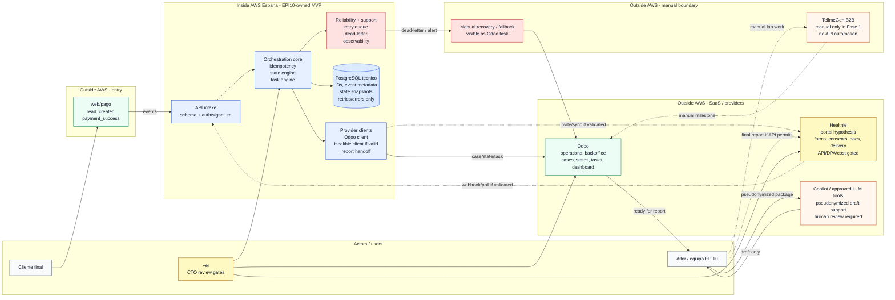
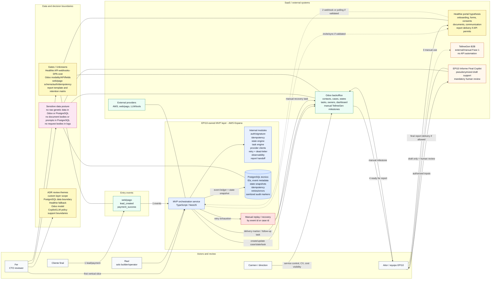
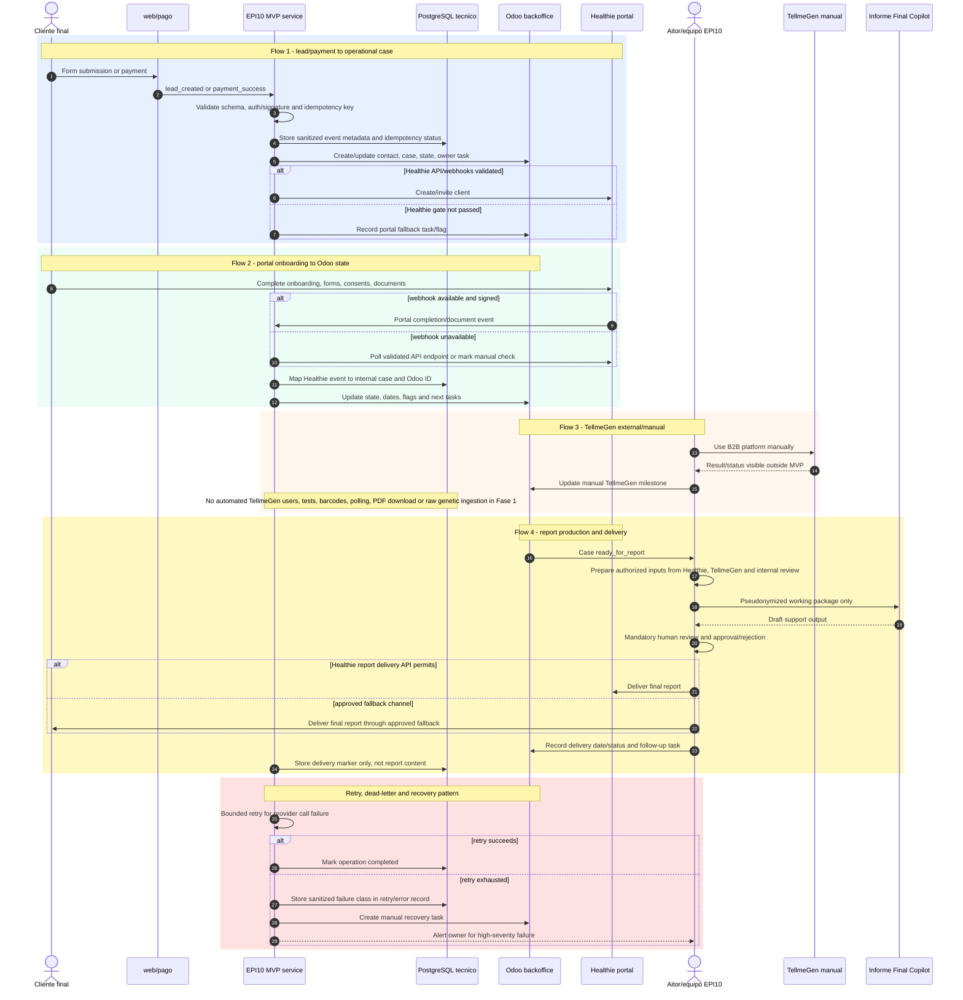
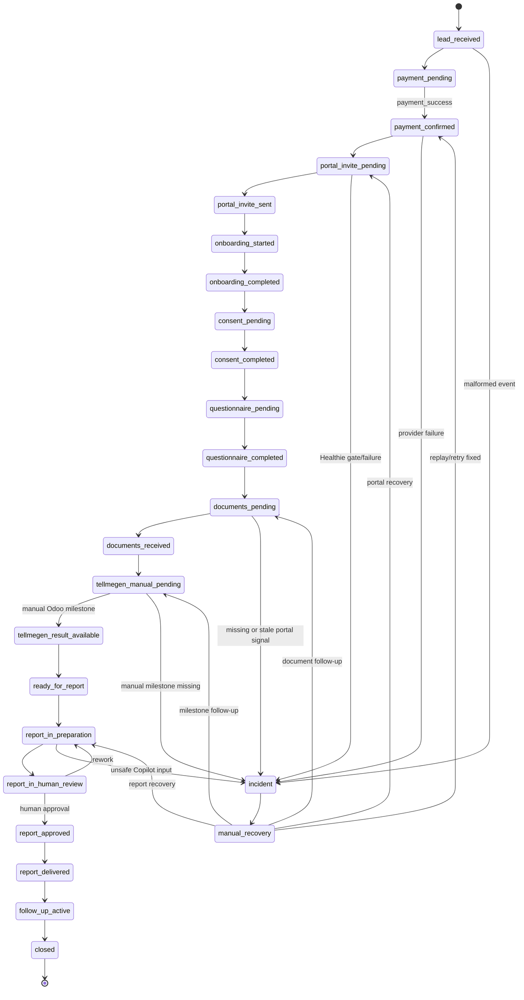
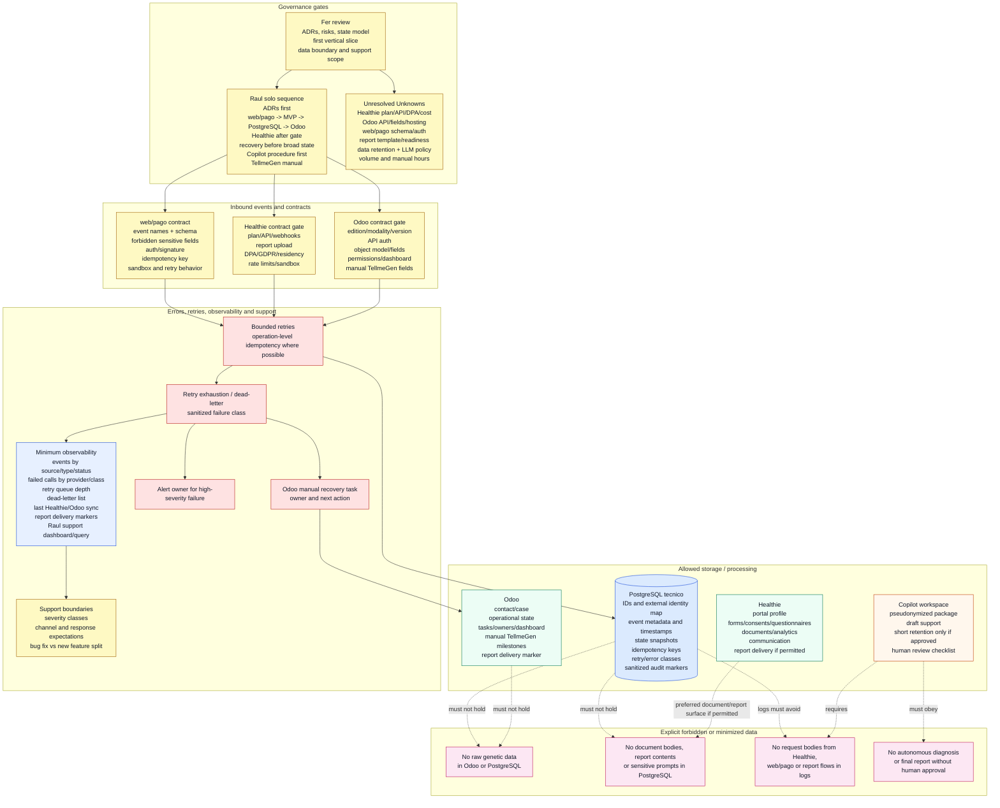

# Architecture System Design Mermaid v1

Visual redesign for the Fer CTO weekly on 2026-06-25. This document restates the current EPI10 Salud MVP 1.0 architecture package as renderable Mermaid diagrams. It does not change architecture decisions, provider assumptions or delivery scope.

## Overview

EPI10 MVP 1.0 is a small owned orchestration layer, not a full healthcare platform. Web/pago emits lead and payment events. The EPI10-owned TypeScript/NestJS service in AWS Espana validates events, applies idempotency, records technical metadata in PostgreSQL, coordinates Odoo operational state and integrates Healthie only where API/webhook/DPA/cost validation permits.

Odoo remains the operational source of truth for cases, states, tasks, owners, dashboard and manual TellmeGen milestones. Healthie is the customer portal hypothesis for onboarding, forms, consents, documents, communication and report delivery. TellmeGen stays external/manual in Fase 1. EPI10 Informe Final Copilot is controlled draft support with pseudonymization and mandatory human review.

## Diagram 0 - Big Picture Simplified

This first diagram is intentionally shallow. Its only job is to make the boundary obvious at a glance: actors and web/pago sit outside the custom runtime, the EPI10-owned service and PostgreSQL live inside AWS Espana, SaaS/provider tools stay outside AWS, and TellmeGen remains a manual/out-of-system boundary in Fase 1.

## Diagram 1 - Architecture Context

This context view separates the customer entry path, EPI10-owned orchestration, SaaS/external systems, manual boundaries and CTO review gates. Yellow nodes are gated or Unknown, not assumed capabilities.

## Diagram 2 - Event and Data Flow

The sequence view keeps the four source flows explicit. It also shows bounded retries, dead-letter/manual recovery and the rule that TellmeGen data does not enter MVP/PostgreSQL automatically in Fase 1.

## Diagram 3 - Operational State Lifecycle

The state model is a draft for workshop validation. Odoo is the visible operational state surface; PostgreSQL may store technical state snapshots for idempotency/replay; Healthie contributes portal signals; TellmeGen milestones remain manual in Odoo.

## Diagram 4 - Data Boundaries, Security And Recovery

This view highlights what each system may hold, what must not be stored, and how failures become observable recovery work. It intentionally treats provider capabilities as gates where the source architecture says Unknown.

## Contracts And Gates

| Area | Still to define or validate |
| --- | --- |
| web/pago | Event names and schemas, required fields, forbidden sensitive fields, auth/signature or shared secret, idempotency key, sandbox/test events, retry behavior, timeout expectations and event failure owner. |
| Healthie | API plan/add-on and cost, client creation/invitation, form/consent/questionnaire signals, document upload signal, report upload/delivery support, webhook signing/retries/payloads, DPA/GDPR/residency, rate limits and sandbox. |
| Odoo | Edition/modalidad/version, API auth, object model and custom fields, permissions, backups/hosting owner, views/dashboard, task creation model and manual TellmeGen status fields. |
| Copilot / LLM tools | Approved environment, allowed input classes after pseudonymization, prompt/log retention, human review checklist, versioning/final approval record and provider/API cost. |
| TellmeGen | No API integration in Fase 1, manual status vocabulary, owner for Odoo updates, result artifacts allowed for report preparation and evidence that would reopen Fase 2 API design. |

## Failure Modes Preserved As Text

| Failure mode | Preserved design response |
| --- | --- |
| Duplicate `payment_success` | Idempotency key and identity map before side effects. |
| Malformed web/pago event | Reject with clear error, log sanitized reason and notify owner. |
| Odoo API unavailable | Retry, then dead-letter and manual recovery task. |
| Healthie API unavailable or not purchased | Treat as vendor gate, use explicit fallback and do not describe fallback as automation. |
| Healthie webhook missing event | Use polling/manual check fallback if available and show stale marker. |
| Copilot receives non-pseudonymized inputs | Human checklist and script gate before draft generation. |
| LLM/tool stores prompts unexpectedly | Use only approved corporate tools and document retention terms. |
| TellmeGen result status not updated manually | Odoo manual milestone owner and reminder task. |
| Logs contain sensitive payload | Structured logs with redaction and payload-free error classes. |

## ADR And Review Gates

The diagrams preserve the accepted ADR direction: Fase 1 is an operational MVP, a small software propio layer exists for orchestration and traceability, TypeScript/NestJS is the default backend stack, PostgreSQL is technical-only, AWS Espana is the base infrastructure, Healthie is a portal hypothesis, Odoo is operational backoffice, TellmeGen is external/manual, Copilot is draft support with pseudonymization and human review, data minimization is non-negotiable, and the real delivery baseline is Raul solo with Fer weekly CTO review.

The diagrams also keep the ADRs still needing formalization visible: custom layer scope, stack/runtime, PostgreSQL schema/retention/encryption/backups, minimal AWS deployment model, Healthie gate/fallback, Odoo API/backoffice model, TellmeGen no-integration policy, Copilot operating boundary, sensitive data/logs/retention/LLM policy and solo-developer governance.

## Fer Review Questions

- Confirm the first vertical slice: `web/pago -> MVP -> PostgreSQL -> Odoo` with one case, one state transition, idempotency and observable failure.
- Confirm NestJS/TypeScript plus PostgreSQL is still boring enough for Raul solo.
- Confirm Odoo is the operational source of truth and PostgreSQL is only technical support state.
- Confirm Healthie gate and fallback rule.
- Confirm the minimum ADR set before real data enters the system.
- Confirm Copilot starts as checklist plus anonymizer plus human-review workflow before deeper automation.
- Confirm support severity and channel boundaries.

## Workshop Decisions

- Final operational states, owners and blocked-state rules.
- Forms, consents and questionnaires inventory and canonical owner.
- Report template, readiness rule, final format and approval rubric.
- Odoo modality, fields, views, permissions and dashboard needs.
- web/pago event schema, auth, idempotency key, sandbox, owner and error behavior.
- Healthie plan, API add-on, webhook list, report upload support, DPA/GDPR and cost.
- Manual TellmeGen milestones and owner.
- Volume, expected cases per month and current manual hours per case.

## Solo-Developer Sequencing

This is represented as governance, not a Stage 06 plan:

1. Close ADRs and data boundaries before real data.
2. Build the smallest vertical slice: `web/pago -> MVP -> PostgreSQL -> Odoo` with one case, one state transition and idempotency.
3. Add Healthie only after API/webhooks/DPA/cost are validated.
4. Add retry/dead-letter/manual recovery before broad state coverage.
5. Start Copilot as checklist plus anonymizer plus documented human-review process.
6. Keep TellmeGen manual and visible in Odoo.

## QA

The Mermaid version preserves the same architectural information as `supporting/diagram_content_inventory_v1.md`: actors, entry events, owned MVP layer, PostgreSQL, Healthie, Odoo, TellmeGen, Copilot, the four flows, state model, contracts, data boundaries, idempotency/retries/dead-letter/manual recovery, observability/support, failure modes, security/privacy, solo-developer sequencing, ADRs, Fer gates, workshop decisions and unresolved unknowns.

Information intentionally represented as text rather than only diagram: full integration contract checklists, full failure-mode table, ADR inventory themes, Fer review questions, workshop-bound decisions and solo-developer sequencing. These items are too dense for a single readable diagram and are therefore cross-referenced by diagram nodes plus preserved as tables/lists.

Unresolved Unknowns preserved from the source architecture package:

- Healthie plan/API/webhooks/DPA/residency/cost.
- Odoo modality/API/permissions/model, fields, hosting and cost.
- web/pago event schema, auth model, idempotency key and sandbox behavior.
- Report template, required inputs, readiness rule, review rubric and delivery mechanics.
- Data retention matrix, legal/DPO documentation and LLM/provider policy.
- Case volume and current manual hours per case.
