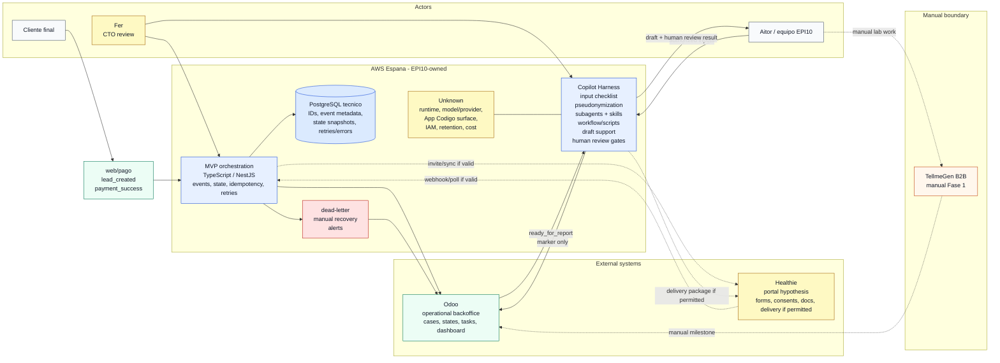
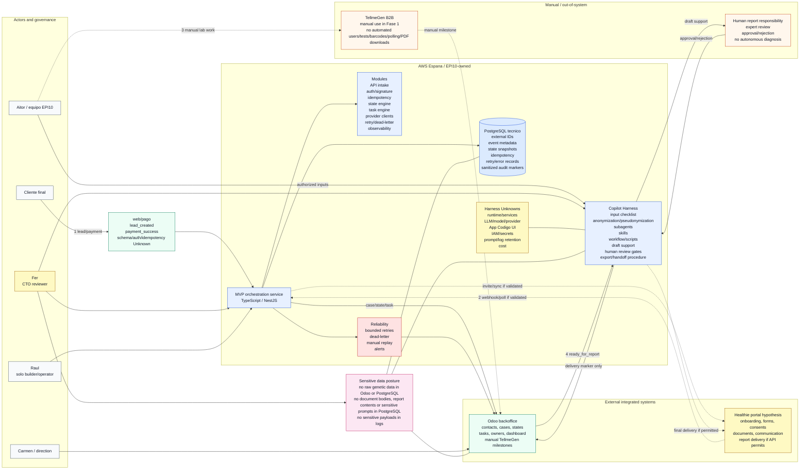
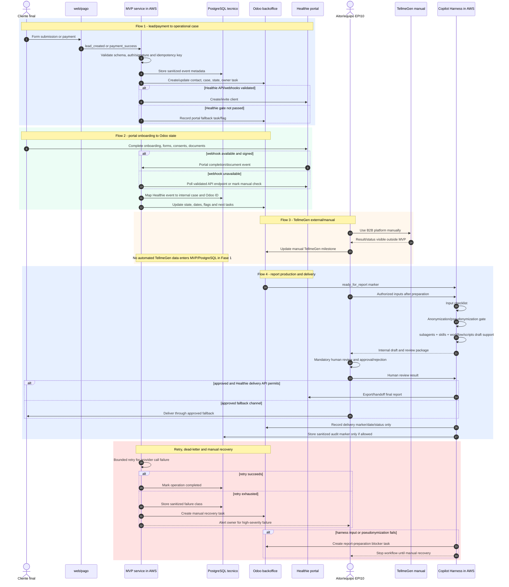
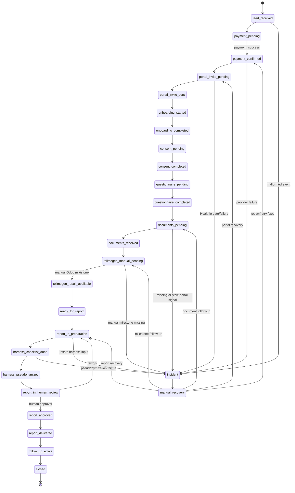
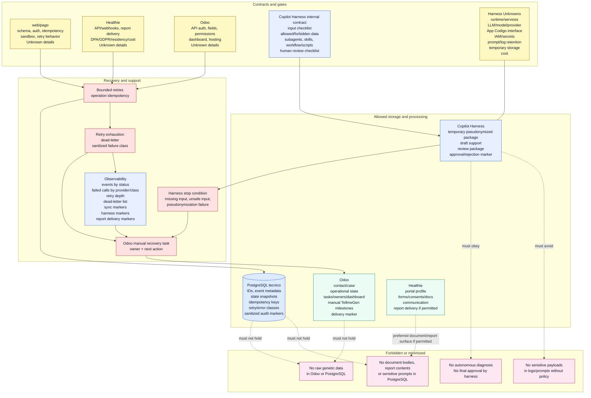

# Architecture System Design Mermaid v2

Visual redesign v2 for the Fer CTO weekly on 2026-06-25. This version corrects
the report-harness boundary: `Copilot Harness` is inside AWS Espana /
EPI10-owned, composed of subagents, skills, workflow/scripts, data-preparation
gates and mandatory human review gates. Runtime/model/App Codigo/IAM/retention
details remain `Unknown`.

## Overview

EPI10 MVP 1.0 is a small owned orchestration system. The customer enters through
web/pago. AWS Espana contains the EPI10-owned MVP service, PostgreSQL technical
DB and Copilot Harness. Healthie and Odoo remain outside AWS as integrated
systems. TellmeGen remains manual in Fase 1.

## Diagram 0 - Big Picture

This diagram is intentionally shallow: it shows what is inside AWS/EPI10-owned,
what remains outside, and how the main relationships work.

## Diagram 1 - Architecture Context

The context view keeps ownership clear: AWS Espana contains the EPI10-owned
runtime and harness; Healthie/Odoo are integrated systems; TellmeGen is manual.

## Diagram 2 - Event And Report Flow

The sequence view preserves flows 1-4. Flow 4 now runs through the AWS/EPI10-owned
Copilot Harness before human review and delivery.

## Diagram 3 - Operational State Lifecycle

The state model remains a draft for workshop validation. v2 adds explicit
harness markers without turning PostgreSQL or Odoo into report-content stores.

## Diagram 4 - Data, Security And Recovery

This view keeps storage and recovery rules visible. The harness may process a
temporary minimized package, but exact storage, logging and retention are
`Unknown` until ADR closure.

## Sequencing And Gates

1. Close ADRs and data boundaries before real data.
2. Build `web/pago -> MVP -> PostgreSQL -> Odoo` first.
3. Add Healthie only after API/webhooks/DPA/cost are validated.
4. Add retry/dead-letter/manual recovery before broad state coverage.
5. Start Copilot Harness as checklist + pseudonymization + subagents/skills
   workflow behind human review.
6. Keep TellmeGen manual and visible in Odoo.

## Unresolved Unknowns

- Healthie plan/API/webhooks/DPA/residency/cost.
- Odoo modality/API/permissions/model, fields, hosting and cost.
- web/pago event schema, auth model, idempotency key and sandbox behavior.
- Report template, required inputs, readiness rule, review rubric and delivery.
- Copilot Harness runtime/services, App Codigo interface, LLM/model/provider,
  IAM/secrets, prompt/log retention, temporary storage and cost.
- Case volume and current manual hours per case.

## QA Note

This Mermaid v2 preserves actors, entry events, MVP service, PostgreSQL,
Healthie, Odoo, TellmeGen, flows 1-4, state model, contracts, data boundaries,
idempotency/retries/dead-letter/manual recovery, observability/support, failure
modes, security/privacy, solo-developer sequencing, ADR/Fer gates and Unknowns.
The corrected boundary is explicit: `Copilot Harness` is inside AWS Espana /
EPI10-owned and includes subagents, skills, workflow/scripts and human review.
