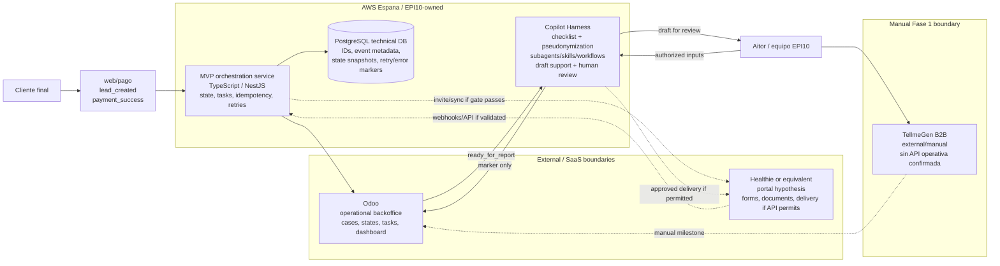

# EPI-10

Repositorio docs-first y agentic harness para disenar, revisar y gobernar EPI10
Salud MVP 1.0: una primera base operativa y tecnica para lanzar el servicio con
portal cliente, backoffice Odoo, trazabilidad, produccion asistida del informe
final y control de alcance sin vender una integracion genetica automatizada que
no existe en Fase 1.

Este repo no es todavia el codigo fuente de una aplicacion. Es el workspace de
contexto, specs, decisiones, outputs y QA usado para convertir una preventa ya
aceptada en un sistema revisable por CTO antes de ejecutar cualquier Stage 06.

## Estado Actual

| Area | Snapshot |
| --- | --- |
| Producto | EPI10 Salud MVP 1.0 esta tratado como Fase 1 operativa: portal cliente, Odoo, software propio ligero en AWS Espana, Copilot Harness, documentacion, formacion y soporte inicial. |
| Tipo de repo | Docs-first agentic harness. No contiene todavia el backend NestJS/PostgreSQL ni una app desplegable. |
| Foco actual | CTO review, ADRs, gates de arquitectura, workshop operativo y preparacion para un primer slice controlado. |
| Stage 06 | Deshabilitado. No crear `06_execution_plan_v1.md` salvo decision explicita posterior. |
| Ejecucion real | Baseline actual: Raul como ejecutor principal y Fer en weekly CTO review. No disenar para un equipo ficticio amplio. |
| TellmeGen | Externo/manual en Fase 1; sin API operativa confirmada. |
| Copilot | Copilot Harness interno AWS Espana / EPI10-owned, con pseudonymization/anonymization y revision humana obligatoria. |

## Start Here

Para un CTO nuevo, la ruta de lectura recomendada en los primeros 15 minutos es:

1. Este `README.md`.
2. Contexto compacto: `02_context/00_intake_context_pack.md`.
3. Problema y criticidad: `04_outputs/weeklies/fer-cto/2026-06-25/01_context_problem_mapping/briefing_contexto_problemas_v1.md`.
4. Arquitectura v2: `04_outputs/weeklies/fer-cto/2026-06-25/02_architecture_system_design/architecture_briefing_v2.md`.
5. ADRs v2: `04_outputs/weeklies/fer-cto/2026-06-25/02_architecture_system_design/supporting/adr_inventory_v2.md`.
6. System design v2: `04_outputs/weeklies/fer-cto/2026-06-25/02_architecture_system_design/supporting/system_design_draft_v2.md`.
7. Workshop operativo: `04_outputs/workshops/epi10-mvp-1-0/scope-operativo/blueprint_interno_workshop_scope_operativo_v1.md`.

Lecturas de soporte:

- Propuesta final: `04_outputs/spec-driving/99_final/epi10-salud-propuesta-tecnica-economica.md`.
- Decision de scope MVP: `04_outputs/spec-driving/02_mvp_scope_decision/02_mvp_scope_decision_v2.md`.
- Blueprint tecnico preventa: `04_outputs/spec-driving/03_technical_presales_blueprint/03_technical_presales_blueprint_v2.md`.
- Diagnostico CTO: `04_outputs/spec-driving/100_cto-advisor_diagnosis/100_cto_advisor_diagnosis_v1.md`.
- Diagrama Mermaid v2 completo: `04_outputs/weeklies/fer-cto/2026-06-25/02_architecture_system_design/visual_redesign/architecture_system_design_mermaid_v2.md`.

## Mapa Del Repositorio

| Ruta | Rol |
| --- | --- |
| `AGENTS.md` | Instrucciones raiz para Codex/agentes: leer harness, usar contexto activo, trabajar una spec cada vez. |
| `CLAUDE.md` | Instrucciones equivalentes para Claude Code. |
| `00_inbox/` | Fuentes crudas importadas. No copiar material bruto a outputs salvo sintesis justificada. |
| `01_harness/` | Reglas siempre activas, stack, taskflow y catalogo de skills. |
| `02_context/` | Contexto compacto. En este repo, la fuente activa es `00_intake_context_pack.md`. |
| `03_specs/` | Specs ejecutables, backlog y decisiones. Trabajar desde una spec activa en `03_specs/now/`. |
| `04_outputs/` | Entregables finales. Incluye spec-driving, weeklies CTO y workshops. |
| `05_scratch/` | Trabajo temporal o debris. No usar como entregable final. |
| `shared/` | Skills y agentes reutilizables. Cargar solo cuando la tarea lo requiera. |
| `runners/` | Guias breves por runner: Codex, Claude y Antigravity. |

## Harness Agentico

El repo usa un flujo Seed -> Distill -> Spec -> Ship -> QA:

| Fase | Resultado |
| --- | --- |
| Seed | Fuentes crudas en `00_inbox/`. |
| Distill | Contexto compacto en `02_context/`, legible rapidamente. |
| Spec | Una spec activa en `03_specs/now/` define objetivo, scope, acceptance criteria y validation commands. |
| Ship | El agente produce entregables en la ruta definida por la spec, normalmente bajo `04_outputs/`. |
| QA | Antes de cerrar: validar acceptance criteria, listar Unknowns, riesgos y comandos ejecutados. |

Reglas operativas:

- Ejecutar una sola spec activa por turno.
- Usar `/goal` cuando la spec lo pida, con el prompt de ejecucion incluido.
- No editar `00_inbox/`, `02_context/`, outputs protegidos, `shared/`, `runners/` o specs ajenas si la spec no lo permite.
- Las skills en `shared/skills/` son on-demand: no se cargan por rutina.
- El QA gate es parte del entregable, no una nota opcional.
- Preservar cambios del usuario o trabajo no relacionado; no revertirlos.

## EPI10 Salud MVP 1.0

El sistema que se esta disenando es un MVP operativo, no una plataforma sanitaria
completa. La Fase 1 busca ordenar el journey desde interes/pago hasta informe
final y seguimiento, reduciendo la dependencia de coordinacion manual de
Aitor/equipo y creando una base tecnica propia pequena pero acumulativa.

Valor de Fase 1:

- portal cliente para onboarding, formularios, consentimientos, cuestionarios,
  documentos, comunicacion, informe y seguimiento, con Healthie como hipotesis;
- Odoo como backoffice operativo para contactos, casos, estados, tareas,
  responsables, dashboard y seguimiento;
- EPI10-owned MVP orchestration service en AWS Espana para eventos, IDs,
  estados, idempotency, retries, errores y trazabilidad tecnica;
- PostgreSQL technical DB solo para datos tecnicos minimos;
- Copilot Harness interno para borrador asistido de informe con
  pseudonymization/anonymization y revision humana obligatoria;
- TellmeGen externo/manual en Fase 1, con milestones visibles en Odoo.

Lo que no se construye ni se promete en Fase 1:

- integracion automatica TellmeGen por API sin nueva evidencia real;
- creacion automatica de usuarios, tests, barcodes, polling o descarga de PDFs
  TellmeGen;
- dashboard genetica;
- diagnostico automatico o interpretacion genetica autonoma;
- aprobacion final por IA;
- plataforma sanitaria completa;
- Stage 06 mientras siga deshabilitado.

## Arquitectura Snapshot



Data posture:

- Odoo es backoffice operativo, no repositorio clinico/genetico.
- PostgreSQL almacena IDs, metadata tecnica, idempotency, snapshots, retries,
  errores sanitizados y markers; no documentos, no report contents, no raw
  genetic data.
- Healthie/equivalente es la hipotesis de superficie cliente/documental si
  plan, API, DPA/GDPR, residencia, idioma y coste validan.
- Copilot Harness no diagnostica, no sustituye criterio profesional y no aprueba
  informes; solo apoya borradores internos bajo revision humana.
- TellmeGen sigue fuera del sistema automatizado en Fase 1.

## ADRs Y Decisiones

| Tema | Posicion actual |
| --- | --- |
| Operacional MVP | Fase 1 es un sistema operativo inicial, no integracion TellmeGen. |
| Software propio | Capa pequena EPI10-owned para orquestacion, estados, idempotency, retries y trazabilidad. |
| Stack | TypeScript / NestJS como default tecnico; validar que sigue siendo "boring enough" para Raul. |
| PostgreSQL | Technical-only; no raw genetic data, documentos, report contents ni prompts sensibles. |
| AWS Espana | Base de infraestructura para runtime EPI10-owned y Copilot Harness. |
| Healthie gate | Hipotesis de portal; no decision final hasta validar plan/API/webhooks/DPA/residencia/coste. |
| Odoo | Source of truth operativo: estados, tareas, owners, dashboard y milestones manuales. |
| TellmeGen | Externo/manual en Fase 1; API futura solo si hay evidencia documentada y viable. |
| Copilot Harness | Interno AWS Espana / EPI10-owned; subagents, skills, workflows/scripts, checklist, pseudonymization/anonymization y human review. Runtime/model/App Codigo/retention siguen `Unknown`. |
| Datos sensibles | Minimization, logs limpios, retencion corta y boundaries explicitos antes de datos reales. |
| Gobernanza | Raul ejecuta; Fer revisa semanalmente ADRs, gates, riesgos y primer slice. |

Fuente principal: `04_outputs/weeklies/fer-cto/2026-06-25/02_architecture_system_design/supporting/adr_inventory_v2.md`.

## Artefactos Clave

| Necesidad | Archivo |
| --- | --- |
| Contexto compacto y fuentes | `02_context/00_intake_context_pack.md` |
| Scope MVP aprobado | `04_outputs/spec-driving/02_mvp_scope_decision/02_mvp_scope_decision_v2.md` |
| Blueprint tecnico preventa | `04_outputs/spec-driving/03_technical_presales_blueprint/03_technical_presales_blueprint_v2.md` |
| Scope inclusions/exclusions | `04_outputs/spec-driving/04_commercial_proposal/supporting/04_scope_inclusions_exclusions_v1.md` |
| Propuesta final | `04_outputs/spec-driving/99_final/epi10-salud-propuesta-tecnica-economica.md` |
| Diagnostico CTO | `04_outputs/spec-driving/100_cto-advisor_diagnosis/100_cto_advisor_diagnosis_v1.md` |
| Weekly contexto/problemas | `04_outputs/weeklies/fer-cto/2026-06-25/01_context_problem_mapping/briefing_contexto_problemas_v1.md` |
| Weekly arquitectura v2 | `04_outputs/weeklies/fer-cto/2026-06-25/02_architecture_system_design/architecture_briefing_v2.md` |
| System design v2 | `04_outputs/weeklies/fer-cto/2026-06-25/02_architecture_system_design/supporting/system_design_draft_v2.md` |
| Mermaid v2 completo | `04_outputs/weeklies/fer-cto/2026-06-25/02_architecture_system_design/visual_redesign/architecture_system_design_mermaid_v2.md` |
| Workshop operativo | `04_outputs/workshops/epi10-mvp-1-0/scope-operativo/blueprint_interno_workshop_scope_operativo_v1.md` |
| Materiales presenciales | `04_outputs/workshops/epi10-mvp-1-0/scope-operativo/materiales_ejecucion_presencial_v1.md` |

## Weekly Fer CTO

La weekly Fer CTO se preparo para revisar criticamente la arquitectura antes de
abrir ejecucion profunda. El criterio actual no es "construir todo", sino
mantener Stage 06 en HOLD y avanzar con gates:

- validar arquitectura y ADRs;
- confirmar primer slice vertical;
- revisar boundaries de datos sensibles;
- confirmar Healthie/Odoo/web/pago gates;
- secuenciar Copilot Harness despues de datos, template y human review;
- ajustar alcance a Raul como ejecutor principal.

Primer slice recomendado para revision CTO:

```text
web/pago -> MVP orchestration service -> PostgreSQL -> Odoo
```

Debe probar un evento, un caso, un estado, idempotency, error sanitizado,
retry/dead-letter y recovery task manual antes de ampliar integraciones.

## Workshop Operativo

El workshop presencial de 3 horas esta disenado para congelar el proceso real
antes de decidir herramientas o backlog:

- journey actual y objetivo;
- estados oficiales y owners;
- source of truth por sistema;
- documentos, formularios, consentimientos e informe;
- TellmeGen externo/manual y milestones Odoo;
- Copilot Harness como apoyo interno con revision humana;
- automatizaciones candidatas;
- Fase 1 imprescindible, deseable, Fase 2 y fuera de alcance;
- decision log, Unknowns y riesgos.

No es Stage 06. Sus salidas deben alimentar ADRs, arquitectura funcional,
criterios de aceptacion y eventualmente un plan de ejecucion solo si se habilita
explicitamente.

## Unknowns Y Gates

Los Unknowns actuales que no deben convertirse en promesas:

| Gate | Estado |
| --- | --- |
| Healthie | Plan, API/webhooks, DPA/GDPR, residencia, idioma, coste, report upload y add-ons siguen `Unknown`. |
| Odoo | Modalidad, version, API, permisos, campos, vistas, hosting, backups y coste real siguen `Unknown`. |
| web/pago | Schema, auth, idempotency key, sandbox, retry behavior y owner tecnico siguen `Unknown`. |
| Informe final | Template, inputs autorizados, regla `ready_for_report`, rubric de revision y formato final siguen `Unknown`. |
| Copilot Harness | Runtime, servicios AWS exactos, App Codigo, LLM/model/provider, IAM, retention, logging y coste siguen `Unknown`. |
| Datos sensibles | Matriz final de datos, retencion, logs, DPO/legal y permisos debe cerrarse antes de datos reales. |
| Operacion | Volumen mensual y horas manuales por caso siguen `Unknown`; ROI cuantitativo no esta cerrado. |
| Soporte | Severidades, canales, tiempos y limites del soporte incluido deben concretarse. |

## Como Trabajar Aqui Con Codex O Claude

1. Leer primero `AGENTS.md` o `CLAUDE.md`.
2. Leer `01_harness/RULES.md`, `01_harness/STACK.md` y `01_harness/TASKFLOW.md`.
3. Usar `02_context/00_intake_context_pack.md` como contexto activo.
4. Elegir una spec en `03_specs/now/` y ejecutarla con `/goal` si la spec lo pide.
5. Antes de editar, ejecutar `git status --short`.
6. Modificar solo las rutas permitidas por la spec.
7. Ejecutar los validation commands de la spec.
8. Cerrar con archivos modificados, checks, acceptance criteria, Unknowns y riesgos.

Nunca asumir que un output previo habilita Stage 06. El run state mantiene Stage
06 pendiente y deshabilitado hasta decision explicita posterior.
